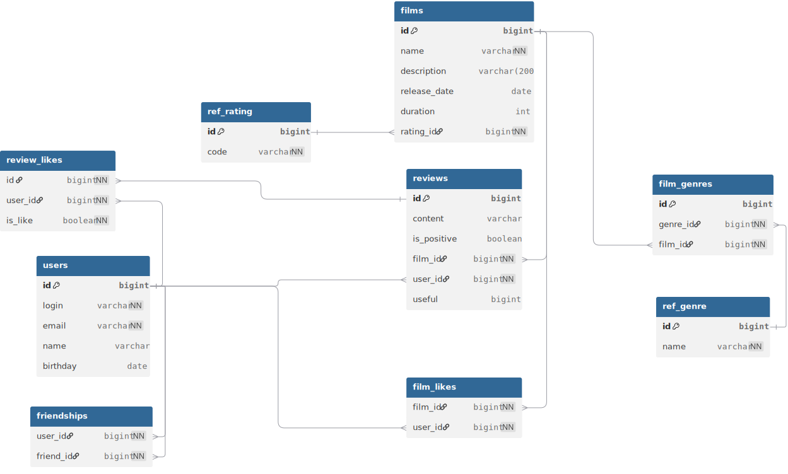

# java-filmorate
## Схема базы данных

### Таблицы

- **users** - информация о пользователях
- **friendships** - информация о дружбе между пользователями
- **films** - информация о фильмах
- **reviews** - отзывы пользователей к фильмам
- **film_likes** - лайки от пользователей фильмам
- **film_genres** - жанры фильмов
- **ref_rating** - справочник возрастных рейтингов фильмов
- **ref_genre** - справочник жанров фильмов

